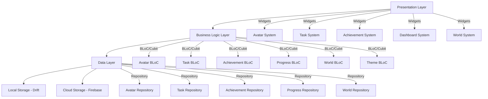

# Design Document

## Overview

LifeXP is a gamified productivity app built with Flutter that transforms real-life tasks into an engaging RPG experience. The app uses a clean, modern UI with beautiful animations to motivate users through character progression, skill development, and world building. The architecture follows Flutter best practices with BLoC pattern for state management, Drift for local storage, and Firebase for optional cloud sync.

## Architecture

### High-Level Architecture



### State Management Strategy

- **BLoC Pattern**: Primary state management using flutter_bloc
- **Cubit**: For simpler state management scenarios (theme, settings)
- **Provider**: For dependency injection and service location
- **Hydrated BLoC**: For state persistence across app restarts

### Data Flow

1. **User Interaction** → UI Widget
2. **Widget** → BLoC Event
3. **BLoC** → Repository Method
4. **Repository** → Data Source (Local/Remote)
5. **Data Source** → Repository → BLoC State
6. **BLoC State** → UI Update

## Components and Interfaces

### Core Components

#### 1. Avatar System
```dart
// Avatar Model
class Avatar {
  final String id;
  final String name;
  final int level;
  final int currentXP;
  final int xpToNextLevel;
  final Map<String, int> attributes; // strength, wisdom, intelligence
  final AvatarAppearance appearance;
  final List<String> unlockedItems;
}

// Avatar BLoC
class AvatarBloc extends Bloc<AvatarEvent, AvatarState> {
  // Handles XP gain, leveling up, attribute increases
}
```

#### 2. Task System
```dart
// Task Model
class Task {
  final String id;
  final String title;
  final String description;
  final TaskType type; // daily, weekly, longTerm
  final TaskCategory category; // health, finance, work, custom
  final int xpReward;
  final int difficulty;
  final DateTime? dueDate;
  final bool isCompleted;
  final int streakCount;
}

// Task BLoC
class TaskBloc extends Bloc<TaskEvent, TaskState> {
  // Handles task CRUD, completion, streak tracking
}
```

#### 3. Achievement System
```dart
// Achievement Model
class Achievement {
  final String id;
  final String title;
  final String description;
  final String iconPath;
  final AchievementType type;
  final Map<String, dynamic> criteria;
  final bool isUnlocked;
  final DateTime? unlockedAt;
}

// Achievement BLoC
class AchievementBloc extends Bloc<AchievementEvent, AchievementState> {
  // Handles achievement checking and unlocking
}
```

#### 4. World System
```dart
// World Tile Model
class WorldTile {
  final String id;
  final String name;
  final String imagePath;
  final bool isUnlocked;
  final int unlockRequirement;
  final TileType type;
}

// World BLoC
class WorldBloc extends Bloc<WorldEvent, WorldState> {
  // Handles world progression and tile unlocking
}
```

### UI Components

#### 1. Navigation Structure
- **Bottom Navigation**: Home, Tasks, Progress, World, Profile
- **Drawer**: Settings, Achievements, Help
- **Floating Action Button**: Quick task creation

#### 2. Screen Components

**Home Screen**:
- Avatar display with level and XP bar
- Today's tasks summary
- Quick stats (streak, completed today)
- Motivational message

**Task Screen**:
- Task list with categories
- Add/Edit task functionality
- Streak indicators
- Completion animations

**Progress Screen**:
- XP charts (daily, weekly, monthly)
- Attribute progress bars
- Category breakdown
- Achievement showcase

**World Screen**:
- Interactive map with unlockable tiles
- Pixel art style graphics
- Progress-based unlocks

**Profile Screen**:
- Avatar customization
- Achievement gallery
- Settings access

### Animation System

#### Animation Types
1. **Micro-interactions**: Button presses, task completion
2. **Transitions**: Screen navigation, modal presentations
3. **Celebrations**: Level up, achievement unlock
4. **Progress**: XP bars, attribute growth

#### Implementation
- **Lottie**: Complex celebration animations
- **Rive**: Interactive avatar animations
- **Flutter Animations**: Custom progress bars and transitions
- **Hero Animations**: Smooth screen transitions

## Data Models

### Database Schema (Drift)

```sql
-- Users table
CREATE TABLE users (
  id TEXT PRIMARY KEY,
  name TEXT NOT NULL,
  created_at INTEGER NOT NULL,
  last_active INTEGER NOT NULL
);

-- Avatars table
CREATE TABLE avatars (
  id TEXT PRIMARY KEY,
  user_id TEXT NOT NULL,
  name TEXT NOT NULL,
  level INTEGER DEFAULT 1,
  current_xp INTEGER DEFAULT 0,
  strength INTEGER DEFAULT 0,
  wisdom INTEGER DEFAULT 0,
  intelligence INTEGER DEFAULT 0,
  appearance_data TEXT NOT NULL, -- JSON
  unlocked_items TEXT NOT NULL, -- JSON array
  FOREIGN KEY (user_id) REFERENCES users (id)
);

-- Tasks table
CREATE TABLE tasks (
  id TEXT PRIMARY KEY,
  user_id TEXT NOT NULL,
  title TEXT NOT NULL,
  description TEXT,
  type TEXT NOT NULL, -- daily, weekly, longTerm
  category TEXT NOT NULL,
  xp_reward INTEGER NOT NULL,
  difficulty INTEGER NOT NULL,
  due_date INTEGER,
  is_completed INTEGER DEFAULT 0,
  streak_count INTEGER DEFAULT 0,
  created_at INTEGER NOT NULL,
  completed_at INTEGER,
  FOREIGN KEY (user_id) REFERENCES users (id)
);

-- Achievements table
CREATE TABLE achievements (
  id TEXT PRIMARY KEY,
  user_id TEXT NOT NULL,
  achievement_type TEXT NOT NULL,
  title TEXT NOT NULL,
  description TEXT NOT NULL,
  icon_path TEXT NOT NULL,
  criteria TEXT NOT NULL, -- JSON
  is_unlocked INTEGER DEFAULT 0,
  unlocked_at INTEGER,
  FOREIGN KEY (user_id) REFERENCES users (id)
);

-- World tiles table
CREATE TABLE world_tiles (
  id TEXT PRIMARY KEY,
  user_id TEXT NOT NULL,
  name TEXT NOT NULL,
  image_path TEXT NOT NULL,
  is_unlocked INTEGER DEFAULT 0,
  unlock_requirement INTEGER NOT NULL,
  tile_type TEXT NOT NULL,
  unlocked_at INTEGER,
  FOREIGN KEY (user_id) REFERENCES users (id)
);

-- Progress tracking table
CREATE TABLE progress_entries (
  id TEXT PRIMARY KEY,
  user_id TEXT NOT NULL,
  date INTEGER NOT NULL,
  xp_gained INTEGER DEFAULT 0,
  tasks_completed INTEGER DEFAULT 0,
  category TEXT,
  FOREIGN KEY (user_id) REFERENCES users (id)
);
```

### Data Transfer Objects

```dart
// For API communication and serialization
class AvatarDto {
  final String id;
  final String name;
  final int level;
  final int currentXP;
  final Map<String, int> attributes;
  
  Map<String, dynamic> toJson();
  factory AvatarDto.fromJson(Map<String, dynamic> json);
}
```

## Error Handling

### Error Types
1. **Network Errors**: Connection issues, API failures
2. **Database Errors**: Local storage failures, corruption
3. **Validation Errors**: Invalid user input
4. **Sync Conflicts**: Data inconsistencies between local and remote

### Error Handling Strategy

```dart
// Custom exception classes
class LifeXPException implements Exception {
  final String message;
  final String code;
  final dynamic originalError;
  
  const LifeXPException(this.message, this.code, [this.originalError]);
}

class NetworkException extends LifeXPException {
  const NetworkException(String message) : super(message, 'NETWORK_ERROR');
}

class DatabaseException extends LifeXPException {
  const DatabaseException(String message) : super(message, 'DATABASE_ERROR');
}

// Error handling in BLoC
class TaskBloc extends Bloc<TaskEvent, TaskState> {
  @override
  Stream<TaskState> mapEventToState(TaskEvent event) async* {
    try {
      // Handle event
    } catch (e) {
      yield TaskState.error(e.toString());
      // Log error for analytics
      _errorReportingService.reportError(e);
    }
  }
}
```

### User-Facing Error Messages
- **Network Issues**: "Looks like you're offline! Don't worry, your progress is saved locally."
- **Sync Conflicts**: "We found some conflicts in your data. Let's sort this out!"
- **Validation Errors**: "Oops! Please check your input and try again."

## Testing Strategy

### Testing Pyramid

#### 1. Unit Tests (70%)
- **Models**: Data validation, serialization
- **BLoCs**: State transitions, event handling
- **Repositories**: Data operations, caching
- **Services**: Business logic, calculations

```dart
// Example unit test
group('AvatarBloc', () {
  test('should gain XP when task completed', () {
    // Arrange
    final bloc = AvatarBloc();
    final initialState = AvatarState.initial();
    
    // Act
    bloc.add(GainXPEvent(50));
    
    // Assert
    expect(bloc.state.avatar.currentXP, equals(50));
  });
});
```

#### 2. Widget Tests (20%)
- **UI Components**: Rendering, user interactions
- **Screens**: Layout, navigation
- **Animations**: Trigger conditions, completion

```dart
// Example widget test
testWidgets('TaskCard should show completion animation', (tester) async {
  await tester.pumpWidget(TaskCard(task: mockTask));
  await tester.tap(find.byType(Checkbox));
  await tester.pumpAndSettle();
  
  expect(find.byType(LottieAnimation), findsOneWidget);
});
```

#### 3. Integration Tests (10%)
- **User Flows**: Complete task workflows
- **Data Persistence**: Local storage operations
- **Sync Operations**: Cloud synchronization

### Test Data Management
- **Mock Data**: Consistent test fixtures
- **Test Database**: In-memory database for testing
- **Golden Tests**: UI consistency verification

## Performance Considerations

### Optimization Strategies

#### 1. Database Performance
- **Indexing**: Proper indexes on frequently queried columns
- **Batch Operations**: Bulk inserts/updates for sync
- **Connection Pooling**: Efficient database connections

#### 2. UI Performance
- **Lazy Loading**: Load data as needed
- **Image Caching**: Cache avatar and world images
- **Animation Optimization**: Use efficient animation libraries

#### 3. Memory Management
- **Stream Disposal**: Proper cleanup of BLoC streams
- **Image Memory**: Optimize image loading and caching
- **Background Processing**: Efficient background tasks

### Monitoring
- **Performance Metrics**: App startup time, frame rates
- **Memory Usage**: Track memory leaks
- **Battery Usage**: Monitor background activity

## Security Considerations

### Data Protection
- **Local Encryption**: Encrypt sensitive local data
- **Secure Storage**: Use flutter_secure_storage for tokens
- **Input Validation**: Sanitize all user inputs

### Privacy
- **Data Minimization**: Collect only necessary data
- **User Consent**: Clear privacy policy and consent
- **Data Retention**: Automatic cleanup of old data

### Authentication (Future)
- **Firebase Auth**: Secure user authentication
- **Token Management**: Secure token storage and refresh
- **Biometric Auth**: Optional biometric authentication

## Accessibility

### Accessibility Features
- **Screen Reader Support**: Semantic labels and hints
- **High Contrast**: Support for high contrast themes
- **Font Scaling**: Respect system font size settings
- **Color Blind Support**: Color-blind friendly color schemes

### Implementation
```dart
// Semantic labels for screen readers
Semantics(
  label: 'Complete task: ${task.title}',
  child: Checkbox(
    value: task.isCompleted,
    onChanged: _onTaskCompleted,
  ),
);

// High contrast theme support
ThemeData.from(
  colorScheme: ColorScheme.highContrast(),
);
```

## Theming System

### Theme Architecture
```dart
// Custom theme data
class LifeXPTheme {
  final ColorScheme colorScheme;
  final TextTheme textTheme;
  final Map<String, Color> customColors;
  final Map<String, TextStyle> customTextStyles;
}

// Theme BLoC
class ThemeBloc extends Cubit<ThemeState> {
  void changeTheme(LifeXPTheme theme) => emit(ThemeState(theme));
  void toggleDarkMode() => emit(state.copyWith(isDark: !state.isDark));
}
```

### Theme Variants
- **Light Theme**: Clean, bright interface
- **Dark Theme**: Comfortable night viewing
- **Unlockable Themes**: Progress-based theme rewards
- **Seasonal Themes**: Special event themes

## Offline Support

### Offline Strategy
1. **Local-First**: All operations work offline
2. **Background Sync**: Automatic sync when online
3. **Conflict Resolution**: Smart merge strategies
4. **Offline Indicators**: Clear offline status

### Sync Implementation
```dart
class SyncService {
  Future<void> syncData() async {
    try {
      await _syncTasks();
      await _syncAvatar();
      await _syncAchievements();
      await _syncProgress();
    } catch (e) {
      // Handle sync errors gracefully
      _scheduleRetry();
    }
  }
  
  Future<void> _resolveConflicts(List<ConflictData> conflicts) async {
    // Implement conflict resolution logic
    // Priority: most recent changes win
  }
}
```

## Notification System

### Notification Types
1. **Task Reminders**: Scheduled notifications for pending tasks
2. **Streak Alerts**: Warnings before streak breaks
3. **Achievement Celebrations**: Immediate achievement notifications
4. **Motivational Messages**: Encouraging re-engagement

### Implementation
```dart
class NotificationService {
  Future<void> scheduleTaskReminder(Task task) async {
    await _localNotifications.schedule(
      task.id.hashCode,
      'Don\'t forget your goal!',
      'Complete "${task.title}" to keep your streak alive! 🔥',
      _calculateNotificationTime(task),
    );
  }
  
  Future<void> showAchievementNotification(Achievement achievement) async {
    await _localNotifications.show(
      achievement.id.hashCode,
      'Achievement Unlocked! 🏆',
      'You earned "${achievement.title}"!',
      _achievementNotificationDetails,
    );
  }
}
```

### Smart Scheduling
- **Optimal Timing**: Based on user activity patterns
- **Frequency Control**: Prevent notification spam
- **Context Awareness**: Respect do-not-disturb settings