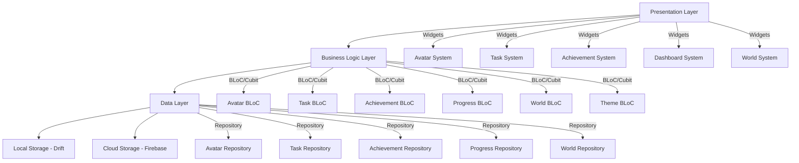
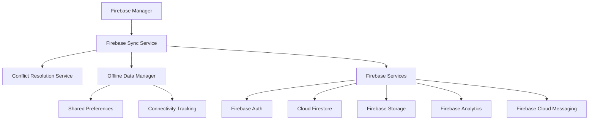

# LifeXP: UI Analysis and Implementation Plan

## 1. Overview

LifeXP is a gamified productivity application built with Flutter that transforms real-life tasks into an engaging RPG experience. The app features character progression, skill development, world building, and achievement tracking to motivate users through gamification.

The application follows clean architecture principles with BLoC pattern for state management, Drift for local storage, and Firebase for cloud synchronization. While the core structure is in place, several key features remain as placeholders that need to be fully implemented.

### 1.1 Current State Analysis

The application has a solid foundation with:
- Authentication system (Firebase Auth integration)
- Task management with streak tracking and XP rewards
- Basic avatar system with level progression
- Achievement tracking framework
- World building with interactive map
- Progress analytics and visualization
- Offline-first architecture with cloud sync capabilities

The application requires enhancement to fully implement all features with proper UI integration:
- Avatar customization with visual representation
- Complete achievement tracking with UI display
- Interactive world map with tile unlocking mechanics
- Comprehensive progress dashboard with analytics
- Smart notification system
- Enhanced cloud synchronization
- All UI elements with proper functionality

## 2. Architecture

### 2.1 High-Level Architecture



### 2.2 Firebase Integration Architecture

The application has a comprehensive Firebase integration with:
- Firebase Authentication for user management
- Cloud Firestore for data synchronization
- Firebase Storage for asset storage (currently underutilized but ready for implementation)
- Firebase Analytics for user behavior tracking
- Firebase Cloud Messaging for notifications
- Offline-first data management with sync queuing
- Conflict resolution strategies
- Background sync with exponential backoff



## 3. Feature Implementation Plan

### 3.1 Avatar System Enhancement

#### 3.1.1 Current State
- Avatar model with level, XP, and attributes exists
- Basic avatar display on profile and home screens
- Level progression logic implemented
- Missing: Visual representation and customization UI

#### 3.1.2 Implementation Tasks

1. **Avatar Visualization**
   - Create AvatarRenderer widget that displays avatar based on appearance data
   - Implement Rive animations for avatar interactions
   - Add avatar customization preview in real-time
   - Create visual feedback for attribute increases (strength, wisdom, intelligence)

2. **Avatar Customization**
   - Implement AvatarCustomizationPanel with item selection
   - Add unlockable items system with visual previews
   - Create avatar appearance data model
   - Implement avatar customization persistence

3. **Avatar Animations**
   - Create idle animations with personality
   - Implement attribute-specific animations
   - Add level-up transformation animations
   - Create celebration animations for achievements

#### 3.1.3 Firebase Integration
- Store avatar appearance data in Firestore
- Sync customization changes across devices
- Implement avatar asset storage in Firebase Storage
- Use Firebase Analytics to track avatar customization trends
- Implement cloud-based avatar templates and themes

### 3.2 Achievement System Completion

#### 3.2.1 Current State
- Achievement model with unlock criteria exists
- Basic achievement tracking framework
- Missing: Achievement unlocking logic, UI display, and celebration

#### 3.2.2 Implementation Tasks

1. **Achievement Logic**
   - Implement achievement checking service
   - Create achievement unlock criteria evaluators
   - Add achievement progress tracking
   - Implement achievement dependencies (unlock chains)

2. **Achievement UI**
   - Create AchievementGallery widget
   - Implement AchievementBadge display with unlock animations
   - Add achievement detail view
   - Create progress indicators for partial achievements

3. **Achievement Celebrations**
   - Implement achievement unlock notifications
   - Create celebration animations with Lottie
   - Add haptic feedback for achievements
   - Implement achievement sharing functionality

#### 3.2.3 Firebase Integration
- Store achievement progress in Firestore
- Sync unlocked achievements across devices
- Implement achievement analytics tracking
- Use Firebase Analytics to track achievement unlock patterns
- Store achievement celebration assets in Firebase Storage

### 3.3 World System Enhancement

#### 3.3.1 Current State
- WorldTile model with unlock requirements exists
- Basic world map display
- Missing: Interactive tile unlocking, visual feedback, customization

#### 3.3.2 Implementation Tasks

1. **World Map Interactions**
   - Implement tile selection and information display
   - Create tile unlock animations and visual effects
   - Add progress indicators for partially unlocked tiles
   - Implement zoom and pan functionality for large maps

2. **World Building**
   - Create building placement system with collision detection
   - Implement building customization options
   - Add building interaction animations
   - Create world theme system (seasonal, unlockable themes)

3. **World Progression**
   - Implement tile unlock mechanics based on XP/category progress
   - Create world progression tracking
   - Add world exploration achievements
   - Implement world state persistence

#### 3.3.3 Firebase Integration
- Store world state in Firestore
- Sync tile unlocks and building placements
- Implement world backup and restore functionality
- Add collaborative world features (future)
- Use Firebase Storage for world map assets and building graphics
- Implement Firebase Analytics for world exploration tracking

### 3.4 Progress Dashboard Enhancement

#### 3.4.1 Current State
- Progress tracking with XP charts exists
- Basic attribute visualization
- Missing: Comprehensive analytics, detailed statistics, trend analysis

#### 3.4.2 Implementation Tasks

1. **Advanced Analytics**
   - Implement detailed category breakdowns
   - Create trend analysis with predictive insights
   - Add productivity pattern recognition
   - Create comparison charts (daily, weekly, monthly)

2. **Statistics Enhancement**
   - Implement streak analysis and visualization
   - Add completion rate tracking
   - Create time-based productivity metrics
   - Add goal achievement statistics

3. **Data Visualization**
   - Enhance XP charts with interactive elements
   - Create attribute progression timelines
   - Add heat maps for activity patterns
   - Implement export functionality for progress data

#### 3.4.3 Firebase Integration
- Store analytics data in Firestore for trend analysis
- Implement cross-device progress comparison
- Add social features (leaderboards, challenges)
- Use Firebase Analytics for detailed user behavior insights
- Implement Firebase Storage for exporting progress reports

### 3.5 Notification System Enhancement

#### 3.5.1 Current State
- Basic notification framework exists
- Task reminder scheduling implemented
- Missing: Smart scheduling, achievement notifications, customization

#### 3.5.2 Implementation Tasks

1. **Smart Scheduling**
   - Implement user pattern analysis for optimal timing
   - Create adaptive notification frequency
   - Add context-aware notifications (time, location)
   - Implement notification snooze and rescheduling

2. **Notification Types**
   - Create achievement unlock notifications
   - Implement streak maintenance reminders
   - Add motivational re-engagement notifications
   - Create milestone celebration notifications

3. **Notification Customization**
   - Add notification category preferences
   - Implement notification themes and sounds
   - Create notification action buttons
   - Add notification scheduling UI

#### 3.5.3 Firebase Integration
- Store notification preferences in Firestore
- Implement cross-device notification sync
- Add analytics for notification effectiveness
- Use Firebase Cloud Messaging for cross-platform notifications
- Implement Firebase Analytics for notification engagement tracking

### 3.6 Cloud Synchronization Enhancement

#### 3.6.1 Current State
- Comprehensive sync service with conflict resolution exists
- Offline-first architecture implemented
- Missing: User-facing sync controls, status indicators, backup management

#### 3.6.2 Implementation Tasks

1. **Sync Management UI**
   - Create sync status indicators
   - Implement manual sync triggers
   - Add sync conflict resolution UI
   - Create sync history and logs

2. **Backup and Restore**
   - Implement automated backup scheduling
   - Create backup management UI
   - Add selective restore functionality
   - Implement backup encryption

3. **Data Migration**
   - Create data export functionality
   - Implement import from other productivity apps
   - Add data validation and error handling
   - Create migration progress indicators

#### 3.6.3 Firebase Integration
- Enhance existing sync service with better error handling
- Implement real-time sync status updates
- Add sync analytics and performance monitoring
- Use Firebase Storage for backup storage and management
- Implement Firebase Functions for automated backup processing

## 4. Data Models & ORM Mapping

### 4.1 Enhanced Avatar Model
```dart
class Avatar {
  final String id;
  final String userId;
  final String name;
  final int level;
  final int currentXP;
  final int xpToNextLevel;
  final int totalXP;
  final Map<String, int> attributes; // strength, wisdom, intelligence
  final AvatarAppearance appearance;
  final List<String> unlockedItems;
  final List<String> equippedItems;
  final DateTime createdAt;
  final DateTime updatedAt;
}
```

### 4.2 Enhanced Achievement Model
```dart
class Achievement {
  final String id;
  final String userId;
  final String title;
  final String description;
  final String iconPath;
  final AchievementType type;
  final Map<String, dynamic> criteria;
  final List<String> dependencies;
  final double progress;
  final bool isUnlocked;
  final DateTime? unlockedAt;
  final DateTime createdAt;
  final DateTime updatedAt;
}
```

### 4.3 Enhanced World Model
```dart
class WorldTile {
  final String id;
  final String userId;
  final String name;
  final String description;
  final String imagePath;
  final bool isUnlocked;
  final int unlockRequirement;
  final TileType type;
  final List<Building> buildings;
  final DateTime? unlockedAt;
  final DateTime createdAt;
  final DateTime updatedAt;
}
```

## 5. Business Logic Layer

### 5.1 Avatar BLoC Enhancements
```dart
class AvatarBloc extends Bloc<AvatarEvent, AvatarState> {
  // Current events
  GainXP(int amount)
  LevelUp()
  IncreaseAttribute(AttributeType attribute, int amount)
  CustomizeAvatar(AvatarAppearance appearance)
  EquipItem(String itemId)
  UnlockItem(String itemId)
  
  // New events to implement
  LoadAvatarCustomizationOptions()
  PreviewAvatarAppearance(AvatarAppearance appearance)
  SaveAvatarCustomization()
}
```

### 5.2 Achievement BLoC Enhancements
```dart
class AchievementBloc extends Bloc<AchievementEvent, AchievementState> {
  // Current events
  LoadAchievements(String userId)
  
  // New events to implement
  CheckAchievementProgress()
  UnlockAchievement(String achievementId)
  LoadAchievementDetails(String achievementId)
  ShareAchievement(String achievementId)
}
```

### 5.3 World BLoC Enhancements
```dart
class WorldBloc extends Bloc<WorldEvent, WorldState> {
  // Current events
  LoadWorldTiles(String userId)
  CreateDefaultWorld(String userId)
  UnlockTile(String tileId, int currentXP, Map<String, int> categoryProgress)
  
  // New events to implement
  PlaceBuilding(String tileId, Building building)
  CustomizeTile(String tileId, TileCustomization customization)
  LoadWorldDetails(String worldId)
  SaveWorldState()
}
```

## 6. UI Component Implementation

### 6.1 Avatar Components
1. **AvatarRenderer** - Visual representation of avatar with animations
2. **AvatarCustomizationPanel** - Item selection and appearance customization
3. **AttributeBar** - Visual progress bars for character attributes
4. **AvatarPreview** - Real-time preview of customization changes

### 6.2 Achievement Components
1. **AchievementGallery** - Grid display of all achievements
2. **AchievementBadge** - Individual achievement display with unlock state
3. **AchievementDetails** - Detailed view with progress and criteria
4. **AchievementCelebration** - Animation overlay for unlocked achievements

### 6.3 World Components
1. **WorldMap** - Interactive map with tile rendering
2. **TileInfoPanel** - Detailed information about selected tiles
3. **BuildingPlacement** - UI for placing buildings on tiles
4. **WorldStatsPanel** - Analytics and progress overview

### 6.4 Progress Components
1. **XPChart** - Interactive XP progression charts
2. **CategoryBreakdownChart** - Visual category performance breakdown
3. **ProgressStatsCard** - Detailed statistics for each category
4. **TrendAnalysis** - Predictive insights and pattern recognition

## 7. Firebase Integration Enhancements

### 7.1 Firebase Storage Utilization
- Store avatar customization assets
- Store world map images and building graphics
- Store achievement icons and celebration animations
- Implement content delivery network (CDN) for faster loading
- Use Firebase Storage for user-generated content (world builds, avatar customizations)
- Implement storage quotas and cleanup policies

### 7.2 Firebase Analytics
- Track user engagement with gamification features
- Monitor achievement unlock rates and patterns
- Analyze world progression and exploration
- Measure notification effectiveness and user retention
- Implement event tracking for all major user actions
- Create custom analytics dashboards for user behavior insights

### 7.3 Firebase Cloud Messaging
- Implement real-time notifications for achievements
- Send challenge invitations from other users
- Notify about world events and updates
- Send personalized motivation messages
- Implement notification channels for different message types

### 7.4 Server-Side Processing (Future Enhancement)
- Implement Python-based server-side achievement validation
- Create automated world events and challenges
- Add social features like friend challenges
- Implement cross-platform data synchronization
- Use Python backend for automatic backup and data processing
- Implement push notifications for real-time events and challenges

## 8. Testing Strategy

### 8.1 Unit Tests
- Avatar progression and attribute calculations
- Achievement criteria evaluation logic
- World tile unlock mechanics
- Progress analytics calculations
- Conflict resolution algorithms

### 8.2 Widget Tests
- Avatar customization UI interactions
- Achievement gallery display and filtering
- World map interactions and tile selection
- Progress dashboard chart rendering
- Notification settings and scheduling

### 8.3 Integration Tests
- End-to-end avatar customization workflow
- Achievement unlock and celebration flow
- World building and exploration experience
- Progress tracking and analytics accuracy
- Offline-to-online sync scenarios

## 9. Implementation Priority

### Phase 1: Core UI Components (High Priority)
1. Avatar Customization Screen - Interactive UI with real-time preview
2. Achievement Gallery - Grid display with unlock animations
3. World Map Screen - Interactive tile selection and unlocking
4. Progress Dashboard - Charts and analytics visualization

### Phase 2: Integrated Features (Medium Priority)
1. Smart Notification System - UI controls with scheduling
2. Advanced Analytics Dashboard - Trend analysis and insights
3. Cloud Sync Management - Status indicators and controls
4. Celebration Animations - Level up and achievement celebrations

### Phase 3: Enhancement Features (Low Priority)
1. Social Features - Leaderboards and challenges
2. Collaborative World Building - Multi-user world interactions
3. AI-based Productivity Insights - Predictive analytics
4. Cross-platform Data Synchronization - Seamless device switching

### Firebase Integration Approach
1. Use Firebase Storage for all asset storage (avatar items, world maps, achievement icons)
2. Enhance analytics with Firebase Analytics for user behavior tracking
3. Use Firebase Cloud Messaging for real-time notifications and challenges
4. Leverage Firebase Authentication for advanced user management features
5. Utilize Cloud Firestore for data synchronization across devices

## 10. Technical Considerations

### 10.1 Performance Optimization
- Implement lazy loading for large data sets
- Optimize avatar and world graphics for mobile performance
- Use efficient animation libraries to maintain 60fps
- Implement database indexing for faster queries
- Optimize Firebase Storage usage with proper caching strategies
- Implement pagination for large data sets in Firestore

### 10.2 Memory Management
- Properly dispose of BLoC streams and resources
- Optimize image loading and caching
- Implement background processing for heavy operations
- Monitor memory usage during animations
- Implement Firebase data caching to reduce network requests
- Use efficient data structures for storing game state

### 10.3 Security
- Encrypt sensitive local data
- Secure Firebase configuration and credentials
- Implement proper input validation
- Follow privacy best practices for user data
- Use Firebase Security Rules to protect user data
- Implement proper authentication checks for all operations

### 10.4 Accessibility
- Ensure screen reader support for all interactive elements
- Implement high contrast theme variants
- Support system font scaling
- Add color-blind friendly color schemes

### 10.5 Code Quality Assurance
- Run `flutter analyze` frequently to catch bugs early
- Fix all analyzer issues before committing code
- Implement comprehensive unit and widget tests
- Use proper error handling in all UI components
- Follow Flutter best practices for state management
- Maintain consistent code style throughout the project

## 11. Implementation Approach

The implementation will follow a UI-first approach with tight integration between frontend and backend services:

### Phase 1: Core UI Implementation (2-3 weeks)
- Implement Avatar Customization Screen with real-time preview
- Create Achievement Gallery with unlock animations
- Develop World Map Screen with interactive tile selection
- Build Progress Dashboard with data visualization

### Phase 2: Service Integration (3-4 weeks)
- Connect Avatar UI to Avatar BLoC and Repository
- Integrate Achievement UI with Achievement BLoC logic
- Link World Map UI to World BLoC and tile unlocking
- Connect Progress Dashboard to Progress BLoC and analytics

### Phase 3: Enhancement Features (4-6 weeks)
- Implement Smart Notification System with UI controls
- Add Advanced Analytics and Data Visualization
- Enhance Cloud Synchronization with User Controls
- Implement Celebration Animations and Haptic Feedback

### Quality Assurance
- Run `flutter analyze` frequently during development
- Fix all code issues before proceeding to next phase
- Implement comprehensive unit and widget tests
- Conduct integration testing for all feature combinations


